# <div align="center"> 🎥 VideoHub — Video Streaming Platform </div>

A full-stack microservices-based video streaming platform built with React.js frontend and Spring Boot backend, featuring video upload, multi-resolution transcoding via FFmpeg, HLS adaptive bitrate streaming, JWT authentication, and async email notifications via Kafka.

## 🌐 Live Demo

- **Website**: https://videohub.raspberryip.com/

## 📸 Screenshots

<details>
   <summary><span style="font-size: 1rem; font-weight: bold">✨ Visual Tour | Screenshots</span></summary>

   ### ✍🏻 Register
   
   

   ### 🏠 Homepage
   
   
   
   
   

   ### 📊 Dashboard
   
   
   
   

   ### 🎬 Video Player

   
   

   ### 📤 Upload
   

   ### 👤 Profile
   
   
</details>

## 🌟 Features

- **Video Streaming**: Upload videos, automatic multi-resolution transcoding (240p–1080p), HLS adaptive bitrate streaming, Video.js player with quality selector, thumbnail generation.
- **Sharing & Embedding**: Generate external shareable links, copy embed code for any website, reverse-proxied S3 URLs for cross-origin playback.
- **Authentication & Security**: JWT-based auth with token blacklisting, role-based access control (User, Admin, Developer, Editor), BCrypt password hashing, protected routes.
- **Email Notifications**: Welcome emails on signup, contact form acknowledgements, markdown-based email templates, async processing via Kafka.
- **User Management**: Sign up with profile image, bio, location, age, gender and phone. Editable profile, personal video dashboard.
- **Production-Ready Infrastructure**: Complete Docker Compose setup with MySQL, Kafka, and Nginx

## 🏗️ Architecture

<details>
   <summary><span style="font-size: 1rem; font-weight: bold">📐 System Architecture Diagram</span></summary>

```
┌─────────────────────────────────────────────────────────────────────────────────┐
│                                   CLIENT                                        │
│                                                                                 │
│                  React 19  ·  Vite  ·  Tailwind CSS  ·  Video.js                │
│                  React Router v7  ·  Axios  ·  React Hook Form + Zod            │
└──────────────────────────────────┬──────────────────────────────────────────────┘
                                   │  HTTPS
                                   ▼
┌─────────────────────────────────────────────────────────────────────────────────┐
│                             NGINX REVERSE PROXY                                 │
│                                                                                 │
│         /api/*  ──────────► Main Application         (backend:4040)             │
│         /s01/video/*  ────► AWS S3 Bucket            (proxy + CORS)             │
│         /nginx-health  ──► Health Check              (200 OK)                   │
└──────────────────────────────────┬──────────────────────────────────────────────┘
                                   │
                                   ▼
┌─────────────────────────────────────────────────────────────────────────────────┐
│                          MAIN APPLICATION SERVICE                               │
│                        Spring Boot 3.4.1  ·  Port 4040                          │
│                                                                                 │
│   ┌─────────────┐  ┌─────────────┐  ┌─────────────┐  ┌─────────────────────┐    │
│   │  Auth (JWT)  │  │  Video API  │  │  User API   │  │  Contact API        │   │
│   │  + Security  │  │  Upload     │  │  CRUD       │  │  + Email Trigger    │   │
│   └─────────────┘  └─────────────┘  └─────────────┘  └─────────────────────┘    │
└──────────┬───────────────────┬──────────────────────────────┬───────────────────┘
           │                   │                              │
           ▼                   ▼                              ▼
┌────────────────────┐  ┌──────────────────────────────────────────────────┐
│    MySQL 9.0       │  │              APACHE KAFKA                        │
│                    │  │         Confluent 7.9.4 + Zookeeper              │
│  users             │  │                                                  │
│  videos            │  │  ┌──────────────────┐  ┌──────────────────────┐  │
│  video_variants    │  │  │  video-processor  │  │  email-notification │  │
│  roles             │  │  │  (4 partitions)   │  │  (4 partitions)     │  │
│  user_roles        │  │  └────────┬─────────┘  └──────────┬───────────┘  │
│                    │  │           │                        │             │
│  HikariCP Pool     │  └───────────┼────────────────────────┼─────────────┘
│  (min 2 / max 10)  │             │                        │
└────────────────────┘             │                        │
                                   ▼                        ▼
                   ┌──────────────────────────┐  ┌──────────────────────┐
                   │   PROCESSOR SERVICE ×5   │  │    EMAIL SERVICE     │
                   │                          │  │                      │
                   │  240p  ─► consumer group1│  │  Kafka Consumer      │
                   │  360p  ─► consumer group2│  │  Spring Mail (SMTP)  │
                   │  480p  ─► consumer group3│  │  Markdown Templates  │
                   │  720p  ─► consumer group3│  │                      │
                   │  1080p ─► consumer group3│  │  • Welcome Email     │
                   │                          │  │  • Contact ACK       │
                   │  FFmpeg Transcoding      │  │  • Notifications     │
                   │  HLS Segmentation (.ts)  │  └──────────────────────┘
                   │  Playlist Gen (.m3u8)    │
                   └────────────┬─────────────┘
                                │
                                ▼
                   ┌──────────────────────────┐
                   │        AWS S3            │
                   │                          │
                   │  /videos/{userId}/       │
                   │    └── {videoId}/        │
                   │        ├── master.m3u8   │
                   │        ├── 240p/         │
                   │        ├── 360p/         │
                   │        ├── 480p/         │
                   │        ├── 720p/         │
                   │        └── 1080p/        │
                   └──────────────────────────┘
```

### Microservices

| Service | Responsibility | Memory |
|---------|---------------|--------|
| **Main Application** | REST API, JWT auth, video upload, serves static frontend | 512 MB |
| **Processor Service ×5** | FFmpeg transcoding to 5 resolutions (240p–1080p), HLS segment generation | 384 MB each |
| **Email Service** | Transactional emails — welcome, contact acknowledgement, notifications | 256 MB |
| **Core Utils** | Shared library — JPA entities, repositories, utilities (non-deployable) | — |

### Kafka Topics

| Topic | Producer | Consumer | Purpose |
|-------|----------|----------|---------|
| `video-processor` | Main Application | Processor Service ×5 | Video transcoding task dispatch |
| `email-notification` | Main Application | Email Service | Async email delivery |

</details>

## 🎬 Video Processing Pipeline

```mermaid
sequenceDiagram
    actor User
    participant FE as Frontend<br/>(React + Video.js)
    participant API as Main Application<br/>(Spring Boot)
    participant DB as MySQL
    participant MQ as Kafka<br/>(video-processor)
    participant PS as Processor Service ×5<br/>(FFmpeg)
    participant S3 as AWS S3

    User->>FE: Upload video file
    FE->>API: POST /api/video/upload
    API->>API: Save original file to disk
    API->>DB: Insert video metadata<br/>status = PROCESSING
    API->>MQ: Publish transcoding task
    API-->>FE: 202 Accepted

    par 240p | 360p | 480p | 720p | 1080p
        MQ->>PS: Consume task (per resolution)
        PS->>PS: FFmpeg transcode<br/>→ HLS segments (.ts)<br/>→ Playlist (.m3u8)
        PS->>S3: Upload HLS segments + playlist
        PS->>DB: Update variant status = COMPLETED
    end

    PS->>PS: Generate master.m3u8
    PS->>S3: Upload master playlist
    PS->>DB: Update video status = AVAILABLE

    User->>FE: Play video
    FE->>S3: Request master.m3u8 (via Nginx proxy)
    S3-->>FE: Return master playlist
    FE->>FE: Video.js selects quality<br/>based on bandwidth
    FE->>S3: Stream HLS segments (.ts)
```



#### Email Notification Flow


## 🛠️ Tech Stack

🖥️ **Frontend**: React.js 19, Vite, Tailwind CSS, Video.js (HLS), React Router v7, React Hook Form, Zod, Radix UI, Axios, React Toastify, Google Analytics.

⚙️ **Backend**: Java 17, Spring Boot 3.4.1, Spring Security (JWT), Spring Data JPA, Spring Kafka, Spring Mail, FFmpeg, Thumbnailator, AWS SDK v2.

🗄️ **Database**: MySQL 9.0 with HikariCP connection pooling.

📨 **Message Broker**: Apache Kafka 7.9.4 with Zookeeper.

☁️ **Cloud**: AWS S3 (video storage), Cloudflare (DNS/CDN).

🐳 **DevOps**: Docker, Docker Compose, Nginx reverse proxy, multi-platform builds (linux/amd64 + linux/arm64), Nginx Proxy Manager (SSL).


## 📂 Project Structure

```
video-hub/
├── frontend/                        # React.js frontend (Vite)
│   └── src/
│       ├── components/              # Reusable UI components
│       ├── pages/                   # Route pages (Home, Dashboard, VideoPage, etc.)
│       └── utils/                   # API client, analytics
├── backend/
│   ├── core-utils/                  # Shared library (entities, services, utilities)
│   ├── main-application/            # REST API + auth + video upload
│   ├── processor-service/           # FFmpeg transcoding + HLS generation
│   └── email-service/               # Email notifications via SMTP
├── deployment/
│   ├── docker-deploy/               # Production docker-compose + .env
│   ├── docker-local/                # Local development docker-compose
│   ├── docker-kafka/                # Kafka + Zookeeper setup
│   ├── docker-mysql/                # MySQL setup
│   └── docker-nginx/                # Nginx reverse proxy config
└── buildx-multiarch-build-and-push.sh  # Build + push multi-arch Docker images
```

## 🚀 Getting Started

### Prerequisites

- Java 17+
- Node.js 16+
- Maven
- FFmpeg
- Docker & Docker Compose

### Installation

1. **Clone the repository**

   ```bash
   git clone https://github.com/niharika2k00/video-hub.git
   cd video-hub
   ```

2. **Start infrastructure (MySQL + Kafka)**

   ```bash
   cd deployment/docker-mysql && docker compose up -d
   cd deployment/docker-kafka && docker compose up -d
   ```

3. **Environment Setup**

   Create a `.env` file in the `backend/` directory:

   ```env
   # Database
   SPRING_DATASOURCE_URL=jdbc:mysql://localhost:3306/videohub
   DATABASE_USERNAME=root
   DATABASE_PASSWORD=pwroot

   # Kafka
   SPRING_KAFKA_BOOTSTRAP_SERVERS=localhost:9093

   # AWS S3
   AWS_PROFILE=default
   AWS_DEFAULT_REGION=us-east-1
   AWS_ACCESS_KEY_ID=your_access_key
   AWS_SECRET_ACCESS_KEY=your_secret_key
   AWS_S3_BUCKET_NAME=your_bucket_name

   # File paths
   CUSTOM_PATH_PROJECT_ROOT_DIR=.
   CUSTOM_PATH_SOURCE_VIDEO_DIR=./videos

   # FFmpeg
   FFMPEG_PATH=/usr/bin/ffmpeg
   FFPROBE_PATH=/usr/bin/ffprobe

   # Email
   EMAIL_SENDER_EMAIL=your_email@gmail.com
   ```

4. **Frontend Environment Setup**

   Create a `.env` file in the `frontend/` directory:

   ```env
   # Application
   VITE_APP_NAME=VideoHub

   # Development
   VITE_APP_ENV=development
   VITE_BACKEND_SERVER_URL=http://localhost:4040

   # Google Analytics (optional)
   REACT_APP_GA_MEASUREMENT_ID=your_ga_measurement_id
   ```

   For production, change to:

   ```env
   VITE_APP_ENV=production
   VITE_BACKEND_SERVER_URL=https://your-domain.com
   ```

5. **Install frontend dependencies**

   ```bash
   cd frontend
   npm install
   ```

5. **Build the backend**

   ```bash
   cd backend
   mvn clean install -DskipTests
   ```

### Running the Application

#### Development Mode (Locally)

```bash
# Terminal 1: Main Application
cd backend/main-application && mvn spring-boot:run

# Terminal 2: Processor Service
cd backend/processor-service && mvn spring-boot:run

# Terminal 3: Email Service
cd backend/email-service && mvn spring-boot:run

# Terminal 4: Frontend
cd frontend && npm run dev
```

The application will be available at:

- Frontend: http://localhost:5173
- Backend API: http://localhost:4040
- MySQL: localhost:3306
- Kafka: localhost:9093

## 🐳 Docker Deployment

### Build and Deploy

1. **Build everything and push multi-arch images**

   ```bash
   ./buildx-multiarch-build-and-push.sh
   ```

   This script builds the frontend, packages all microservices into JARs, creates Docker images for `linux/amd64` and `linux/arm64`, and pushes to Docker Hub.

2. **Deploy on the server**

   ```bash
   # Copy deployment files to server
   scp -r ./deployment niharika@bihan-prod:/home/niharika/videohub

   # SSH into server and start services
   cd deployment/docker-deploy && docker compose up -d
   ```

### Manual Docker Commands

```bash
# Build individual images
docker build -f dev.dockerfile -t main-application:v0.0.1 .
docker build -f dev.dockerfile -t processor-service:v0.0.1 .
docker build -f dev.dockerfile -t email-service:v0.0.1 .

# Run container
docker run -p 4040:4040 main-application:v0.0.1
docker run processor-service:v0.0.1
docker run email-service:v0.0.1

# Pull from Docker Hub
docker pull niharikadutta/main-application:v0.0.1
docker pull niharikadutta/processor-service:v0.0.1
docker pull niharikadutta/email-service:v0.0.1
```

## 🔧 API Endpoints

| Method | Endpoint | Auth | Description |
|--------|----------|------|-------------|
| POST | `/api/auth/register` | No | User registration |
| POST | `/api/auth/login` | No | User login |
| POST | `/api/users/logout` | Yes | User logout |
| GET | `/api/users` | Yes | Get all users |
| GET | `/api/users/{id}` | Yes | Get user by ID |
| PUT | `/api/users/{id}` | Yes | Update user |
| DELETE | `/api/users/{id}` | Admin | Delete user |
| POST | `/api/video/upload` | Yes | Upload video |
| GET | `/api/videos` | Yes | Get all videos |
| GET | `/api/videos?authorId={id}` | Yes | Get user's videos |
| GET | `/api/videos/{id}` | Yes | Get video details |
| DELETE | `/api/videos/{id}` | Yes | Delete video |
| POST | `/api/contact` | No | Submit contact form |
| GET | `/api/test` | No | Health check |

## 🔒 Security

- JWT-based stateless authentication with configurable expiration
- Token blacklisting on logout
- BCrypt password hashing
- Role-based access control: `ROLE_USER`, `ROLE_ADMIN`, `ROLE_DEVELOPER`, `ROLE_EDITOR`, `ROLE_MANAGER`
- CORS configured for frontend origin
- CSRF disabled (stateless REST API)

## 👨‍💻 Author

**Niharika Dutta**

- [GitHub](https://github.com/niharika2k00)
- [LinkedIn](https://www.linkedin.com/in/niharika2k00/)

If you found this project helpful, please give it a star⭐ !

## 📚 References
- https://howvideo.works/#playback
- https://bytebytego.com/courses/system-design-interview/design-youtube
